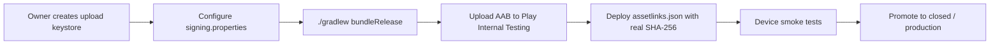

# Giga3 Android — release process (TWA)

This guide covers preparing and uploading the **Giga3 AI** Trusted Web Activity (TWA) to Google Play. The Android app is a thin shell around the production website at **https://www.giga3ai.com/** — no native rewrite, no Paystack changes.

| Item | Value |
|------|--------|
| App name | Giga3 AI |
| Launcher label | Giga3 |
| Application ID | `com.giga3ai.app` |
| Production URL | `https://www.giga3ai.com/` |
| Project path | `android/` |

---

## Overview



1. **Build** — Gradle produces `app-release.aab` (signed when credentials are configured).
2. **Verify** — Digital Asset Links must match before TWA runs full-screen without a browser URL bar.
3. **Test** — Internal testing track with team devices (`internal-testing-checklist.md`).
4. **Policy** — Resolve Paystack vs Play Billing with legal/product before production (`billing-policy-review.md`).

---

## Prerequisites

- JDK 17+ (JDK 21 verified for debug builds in CI/Cloud Agent)
- Android SDK — set `ANDROID_HOME` and `android/local.properties` with `sdk.dir=…` (gitignored)
- Node.js — only if regenerating from the web manifest (`android/scripts/generate-project.mjs`)

---

## Step 1 — Audit configuration (already done in repo)

Confirm before each release:

- `applicationId` = `com.giga3ai.app` in `android/app/build.gradle`
- Launch URL = `https://www.giga3ai.com/` (via `hostName` + `launchUrl`)
- `compileSdkVersion` / `targetSdkVersion` = 36, `minSdkVersion` = 21
- Play Billing disabled in `twa-manifest.json` (`playBilling.enabled: false`)
- Permissions: `POST_NOTIFICATIONS` only in manifest; camera/mic via web APIs

Regenerate after PWA manifest/icon changes:

```bash
cd android
npm install --legacy-peer-deps
node scripts/generate-project.mjs
```

The generator re-applies `release-signing.gradle` automatically.

---

## Step 2 — Signing setup (owner action)

**Do not commit keystores or passwords.**

1. Create an **upload keystore** locally (see `signing.md`).
2. Copy `android/signing.properties.example` → `android/signing.properties` (gitignored).
3. Fill in `storeFile`, passwords, and `keyAlias`.
4. Enable **Google Play App Signing** in Play Console (recommended).

Alternative: set environment variables instead of `signing.properties`:

| Variable | Purpose |
|----------|---------|
| `GIGA3_ANDROID_KEYSTORE_PATH` | Absolute or relative path to `.jks` / `.keystore` |
| `GIGA3_ANDROID_KEYSTORE_PASSWORD` | Keystore password |
| `GIGA3_ANDROID_KEY_ALIAS` | Key alias (default: `android`) |
| `GIGA3_ANDROID_KEY_PASSWORD` | Key password (defaults to keystore password) |

---

## Step 3 — Build release AAB

```bash
cd android
./gradlew assembleDebug    # sanity check (debug keystore)
./gradlew bundleRelease    # produces app-release.aab when signing is configured
```

| Output | Path |
|--------|------|
| Debug APK | `app/build/outputs/apk/debug/app-debug.apk` (gitignored) |
| Release AAB | `app/build/outputs/bundle/release/app-release.aab` (gitignored) |

If signing is **not** configured, `bundleRelease` still runs but produces an **unsigned** AAB — not uploadable to Play until signed.

Bump `versionCode` / `versionName` in `android/app/build.gradle` (and `twa-manifest.json` if regenerating) before each Play upload.

---

## Step 4 — Digital Asset Links (before full TWA verification)

The app declares delegation in `assetStatements`; the website must mirror it at:

`https://www.giga3ai.com/.well-known/assetlinks.json`

**Do not deploy until you have the real SHA-256 fingerprint.** See `digital-asset-links.md` and `assetlinks.template.json`.

Deploy path when approved: `web/public/.well-known/assetlinks.json` → Cloudflare Pages redeploy.

Verify:

`https://digitalassetlinks.googleapis.com/v1/statements:list?source.web.site=https://www.giga3ai.com&relation=delegate_permission/common.handle_all_urls`

---

## Step 5 — Play Console upload

1. Create app with package `com.giga3ai.app` (if not already created).
2. Complete store listing, Data Safety, content rating (see `release-checklist.md`).
3. Upload `app-release.aab` to **Internal testing**.
4. Add tester emails; share opt-in link.
5. Install on physical devices and run `internal-testing-checklist.md`.

---

## Step 6 — Paystack (unchanged)

The TWA loads the production site. Subscriptions and credit packs use **Paystack on the website** — same as the PWA. No Google Play Billing in this project phase. Policy implications: `billing-policy-review.md`.

---

## CI safety

- No GitHub Actions workflow signs release builds by default.
- Keystores, `signing.properties`, and `local.properties` are gitignored.
- Do not add Play signing secrets to repository variables unless using a dedicated, access-controlled release pipeline.

---

## Related docs

| Document | Purpose |
|----------|---------|
| `signing.md` | Keystore creation, Gradle config, secrets |
| `digital-asset-links.md` | SHA-256 source and deployment timing |
| `internal-testing-checklist.md` | Device test matrix |
| `release-checklist.md` | Store listing and policy forms |
| `billing-policy-review.md` | Paystack vs Play Billing |
| `google-sign-in-android.md` | OAuth client setup for Android |
| `android/README.md` | Developer quick start |

---

## Production release checklist (summary)

- [ ] Upload keystore created and backed up securely
- [ ] Play App Signing enabled
- [ ] Signed `app-release.aab` built
- [ ] `assetlinks.json` deployed with correct SHA-256
- [ ] Internal testing smoke tests passed on real devices
- [ ] Billing policy signed off by product/legal
- [ ] Store listing assets complete
- [ ] Staged rollout plan agreed
